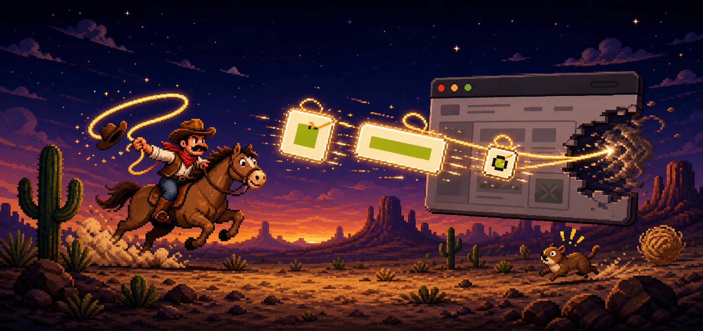
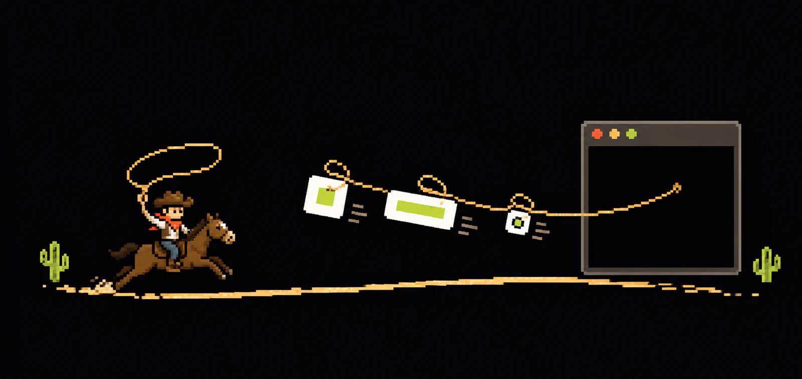

<p align="center">
  <a href="https://logo-yoink.com"></a>
</p>

<h1 align="center">Logo Yoink</h1>

<p align="center">
  <strong>Drop in a website. Ride away with its best logos.</strong>
</p>

<p align="center">
  <a href="https://logo-yoink.com/">Try the live demo</a>
  ·
  <a href="https://logo-yoink.com/docs">Read the docs</a>
  ·
  <a href="#quick-draw">Run it yourself</a>
  ·
  <a href="#use-the-api">Use the API</a>
  ·
  <a href="#how-it-works">How it works</a>
</p>

<p align="center">
  
  
  
</p>

<p align="center">
  
</p>

Logo hunting should not feel like archaeology. Give Logo Yoink one URL and it finds the real image files a site exposes, checks that they work, removes duplicates, and ranks the best choices for:

- **Icon** — apps, avatars, square UI, and favicons
- **Wordmark** — headers, cards, and wider layouts

You get the candidates, their evidence, and downloadable files. No mystery black box. No invented logos.

## Quick draw

### Prerequisites

- [Node.js 22+](https://nodejs.org/) and the bundled npm client
- Internet access to inspect public websites

Logo Yoink does not need a database or a required third-party service. Chromium is used only for the default JavaScript-rendered-logo fallback; the static extractor works without it.

### Install and run

```bash
git clone https://github.com/Hendrikc4/logo-yoink.git
cd logo-yoink
npm ci
npx playwright install chromium
cp .env.example .env.local
npm start
```

Open **http://127.0.0.1:4310**, paste a website, and hit **Yoink it**.

For automatic restarts while editing the API or web app, use `npm run dev` instead of `npm start`. Both commands serve the UI and `/api/extract` from the same local address.

On Linux, use `npx playwright install --with-deps chromium` if Chromium's system libraries are not already installed. To skip the browser download and use static discovery only, set `BROWSER_DISCOVERY=0` in `.env.local`.

The checked-in `.env.example` contains safe local defaults and empty placeholders. `.env.local` is gitignored; do not put API keys in tracked files. A fresh setup needs no secret, and the optional `JINA_API_KEY` and `BESTICON_URL` fallbacks can stay blank.

### Verify the setup

After installation, check the UI and local API without contacting a third-party site (the main server does not need to be running):

```bash
npm run smoke
```

Then verify a real extraction through either the CLI or the running web app:

```bash
npm run cli -- logo-yoink.com
```

The smoke check starts an isolated local server on an available port, verifies the homepage and API request validation, and shuts it down. `npm run check` runs syntax checks, the complete test suite, fixture validation, and this smoke check.

> There is also a cowboy runner up top. Jump the cacti, collect logos, and grab a lasso to auto-yoink the next three. Space, Arrow Up, W, and taps all work. 🤠

## Use the CLI

See the ranked results as JSON:

```bash
npm run cli -- stripe.com
npm run cli -- stripe.com --no-wikimedia-fallback
```

The Wikidata/Wikimedia Commons missing-role fallback is enabled by default. It
requires exact registrable-domain agreement with an active Wikidata official
website statement before validating a current Commons logo through the normal
network/image/SVG safety pipeline. It may abstain, and Commons license metadata
does not waive trademark restrictions.
Use `--no-wikimedia-fallback` in the CLI, `{ wikimediaFallback: false }` with
`extractLogos`, or `"wikimediaFallback": false` in an API request to opt out.

Prefer a white/light logo for a dark surface and a transparent file:

```bash
npm run cli -- stripe.com --theme dark --background transparent
```

Or download the top pick:

```bash
npm run cli -- stripe.com --download ./downloads/stripe
```

Add `--role logo` to download the preferred wordmark instead of the default icon-first pick.

## Use the API

Once the local server is running:

```bash
curl -sS http://127.0.0.1:4310/api/extract \
  -H 'content-type: application/json' \
  -d '{"website":"stripe.com","preferences":{"icon":{"color":"white"},"logo":{"theme":"dark","background":"transparent"}}}'
```

The demo and API use the same default-on Wikidata/Commons fallback. Add
`"wikimediaFallback": false` to the request body when a lookup must remain
first-party-only.

Both `preferences.icon` and `preferences.logo` accept the same optional fields. `theme` accepts `any`, `light`, or `dark` and describes the surface the asset must work on, so `dark` prefers light artwork. `color` accepts `any`, `color`, `white`, or `black`. `background` accepts `any`, `transparent`, or `opaque`. Preferences are best-effort: a matching eligible asset wins when available, otherwise ranking falls back to the best eligible asset.

The response keeps canonical `assets.icon` and `assets.logo` selections and adds ordered `assetVariants.icon` and `assetVariants.logo` arrays. The selected asset is first. Additional entries must represent a distinct theme/color/background combination and clear `variantPolicy.minimumRoleScore` (currently 45, the medium-certainty boundary); delivery-size copies of the same artwork are not promoted as semantic variants. Every variant includes explicit metadata such as `{"theme":"dark","color":"white","background":"transparent"}` plus role-specific `certainty: { score, band }`.

Grouped `assetFamilies`, every ranked `candidate`, normalized `preferences`, and discovery `diagnostics` remain available. The homepage uses the canonical variant arrays for its inline icon and wordmark selectors. “More assets” contains only other high-confidence families and excludes every family already represented by a selected-role variant.

For compatibility, `selectedByRole.icon` and `selectedByRole.wide` remain available. The deprecated `selectedByRole.favicon` key independently reports the best favicon-sized legacy selection; it never changes canonical `assets.icon` or `assets.logo`. When no true icon qualifies, a valid favicon-role candidate may become the canonical icon fallback.

## How it works

<p align="center">
  
</p>

Logo Yoink is a deterministic discovery and ranking pipeline. AI helped build the benchmark used to improve it; AI is **not** called when you extract a logo.

1. **Discover broadly.** The static pass reads the page, structured data, manifests, favicon declarations, image sources, and safe inline SVGs. A bounded browser pass can recover assets rendered by JavaScript.
2. **Validate and deduplicate.** Candidates are downloaded under strict budgets, checked as real image bytes, measured, and collapsed by URL, content hash, and asset family.
3. **Rank for the job.** Each candidate gets icon and wordmark selections from its source, shape, resolution, page placement, home-link evidence, company-name agreement, variant fit, and negative context. The API returns the winners plus the evidence behind every score.

### How the ranking was optimized

The benchmark freezes **500 company websites** and the candidates found on them. AI reviewers inspected numbered contact sheets and produced **2,277 adjudicated candidate labels** covering identity, role, best-in-role, and usability on light and dark backgrounds. Deterministic validators mapped those judgments back to stable candidate IDs; scores and URLs were hidden from the labeling view to reduce bias.

Those labels turned “looks right” into measurable targets: identity precision, role precision, discovery recall, conditional rank recall, end-to-end recall, best-hit rate, and wrong-brand count. Ranking and discovery ideas were then tested as isolated experiments on development data, checked on validation, and rejected when extra coverage cost too much precision. The result is a deliberately simple, interpretable rule set optimized to recover as many usable logos as possible without quietly promoting partner marks, UI icons, or stale brands.

On the frozen current-identity baseline, captured under ranking version 3, a correct icon or wordmark was selected for **327 of 385 sites (84.9%)**. When a correct wordmark was present in that frozen candidate set, the captured ranker selected one **93.3%** of the time. These historical frozen measurements do not qualify later runtime ranking or discovery changes; see [`docs/current-system-logo-optimization-plan.md`](docs/current-system-logo-optimization-plan.md) and the [`visual benchmark schema`](schemas/visual-benchmark-v1/README.md) for the full methodology.

## What gets yoinked?

<table>
  <tr>
    <td width="112" align="center"></td>
    <td><strong>The obvious stuff</strong><br>Visible header images, picture sources, safe inline SVGs, and lazy-loaded assets.</td>
  </tr>
  <tr>
    <td width="112" align="center"></td>
    <td><strong>The hidden clues</strong><br>Schema.org data, metadata, manifests, touch icons, mask icons, tiles, and favicons.</td>
  </tr>
</table>

Every candidate is downloaded, byte-validated, deduplicated, and scored with role-specific rules. If the fast static pass misses an icon or wordmark, the web app can make a bounded Playwright pass for JavaScript-rendered assets.

<details>
<summary><strong>Need more horsepower?</strong></summary>

First-party homepage discovery still runs first. The bounded recovery stages only run for missing eligible roles.

| Need | How |
| --- | --- |
| Skip browser rendering | `BROWSER_DISCOVERY=0 npm start` |
| Recover from blocked or unusable homepages | Add `JINA_API_KEY` to `.env.local` |
| Use a local [Besticon](https://github.com/mat/besticon) fallback | `BESTICON_URL=http://127.0.0.1:8080 npm start` |
| Disable exact-domain Wikidata/Commons recovery | Add `--no-wikimedia-fallback` or set `PUBLIC_DEMO_WIKIMEDIA=0` |
| Follow likely brand/press pages in the CLI | Add `--deep-wide` |
| Inspect one same-origin SPA bundle too | Add `--deep-wide --spa-bundles` |
| Try the measured BIMI icon fallback | Add `--bimi` (experimental, off by default) |

Logo Yoink automatically loads a gitignored `.env.local` file. Normal successful extractions do not use Jina.

The primary local settings are:

| Variable | Default | Purpose |
| --- | --- | --- |
| `HOST` | `127.0.0.1` | Local server bind address |
| `PORT` | `4310` | Local server port |
| `BROWSER_DISCOVERY` | `1` | Enable the Chromium fallback |
| `JINA_API_KEY` | unset | Optional Jina fallback for blocked or unusable homepages |
| `BESTICON_URL` | unset | Optional URL of a local Besticon service |
| `PUBLIC_DEMO_ALLOW_JINA` | `1` | Set to `0` to prevent web/API requests from using Jina |
| `PUBLIC_DEMO_BROWSER` | `1` | Set to `0` to prevent web/API requests from using Chromium |
| `PUBLIC_DEMO_WIKIMEDIA` | `1` | Set to `0` to disable Wikidata/Commons missing-role recovery in the demo |
| `PUBLIC_DEMO_BIMI` | `0` | Set to `1` to enable the experimental BIMI fallback for web/API requests |

`--deep-wide` only runs when the homepage has no accepted wide logo. It follows at most two strong first-party brand, press, or media links and can inspect official ZIP kits. `--spa-bundles` scans at most one same-origin entry bundle, up to 2.2 MB, for a company-logo asset literal.

`--bimi` queries `default._bimi.<domain>` after the first-party recovery stages admitted by the pipeline's existing static/deep/browser gates and before the built-in Google or DuckDuckGo favicon fallbacks. Optional Besticon keeps its existing budgeted discovery position because the frozen BIMI runs did not enable or compare it. BIMI does not trigger a new browser crawl or Jina screenshot solely for a missing icon. It accepts one unambiguous `v=BIMI1` assertion with a nonempty HTTPS `l=` URL, then applies the normal public-address, redirect, timeout, byte, MIME, and conservative SVG-safety checks. Full BIMI SVG profile conformance is not claimed, so canonical icon admission additionally requires measured icon-shaped artwork. BIMI is restricted to icon/favicon-like roles and never supplies `assets.logo`. An `a=` evidence-document pointer is recorded but not certificate-validated, and no trademark or license permission is inferred. The option remains experimental because the frozen development/validation experiment found safe selections but no incremental correct selections over the existing cached-icon fallback.

</details>

<details>
<summary><strong>Developing and benchmarking</strong></summary>

Run the tests:

```bash
npm test
```

Run the same syntax and test checks used by CI:

```bash
npm run check
```

The browser-backed tests require Chromium. Install it with `npx playwright install chromium` (or `npx playwright install --with-deps chromium` on a fresh Linux machine).

The main trail map:

```text
src/discover-static.mjs   find candidates in HTML and metadata
src/discover-browser.mjs  render the bounded browser fallback
src/discover-deep.mjs     inspect official brand paths and kits
src/rank.mjs              score icons and wordmarks, then apply logo preferences
src/extractor.mjs         validate, deduplicate, and orchestrate
src/http-client.mjs       enforce safe, bounded network reads
src/demo/                 share demo policy across local and Vercel adapters
src/server.mjs            serve the tiny local web app and API
src/cli.mjs               print results or download the winner
```

The repository includes frozen 100- and 500-company cohorts plus a separate expanded 800-company fixture for repeatable extraction experiments. The expanded fixture preserves the original 500 rows and adds a curated `major-brands-300` cohort spanning consumer, enterprise, healthcare, finance, media, infrastructure, and multiple geographies. Start a benchmark with:

```bash
npm run benchmark -- --cohort original-100 --output runs/my-run
npm run review-montage -- runs/my-run
```

The runner loads `fixtures/companies-500.json` for legacy cohorts and `fixtures/companies-800.json` for `major-brands-300` or `all-800`, so the frozen 500 is not mutated. Validate both deterministic fixtures with `npm run fixtures:validate` before starting any network capture.

See [`docs/`](docs/) for the benchmark methodology, experiment logs, and visual-labeling workflow.

</details>

<details>
<summary><strong>A few honest limits</strong></summary>

- Some websites block automated clients.
- A site may expose a product icon instead of its company logo.
- Dimensions cannot reveal every padded or awkward wordmark.
- Redirected and rebranded domains can serve stale identity assets.

That is why Logo Yoink returns multiple ranked candidates instead of pretending one guess is always perfect.

The server binds to localhost by default and rejects non-public targets while revalidating redirects. The included public demo route also enforces small JSON-only requests, same-origin browser calls, per-client and global rate limits, a two-extraction concurrency ceiling, duplicate-request coalescing, bounded extractor work, generic errors, and restrictive browser security headers. Jina (when `JINA_API_KEY` is configured), local browser discovery, the one-entry first-party SPA-bundle probe, and exact-domain Wikidata/Commons recovery are enabled as bounded missing-logo fallbacks. Set `PUBLIC_DEMO_ALLOW_JINA=0`, `PUBLIC_DEMO_BROWSER=0`, or `PUBLIC_DEMO_WIKIMEDIA=0` to opt out of the corresponding fallback; the SPA probe remains capped at one same-origin bundle and 2.2 MB.

The in-process rate limiter is intentionally dependency-free, so limits apply per running instance. A multi-instance public deployment should add a distributed edge rate limit or authentication, and should pin the validated public IP at connection time or enforce equivalent outbound-network rules to close the remaining DNS-rebinding window.

</details>

<p align="center">
  
</p>

<p align="center"><strong>Happy yoinkin’.</strong></p>

Released under the [MIT License](LICENSE).
