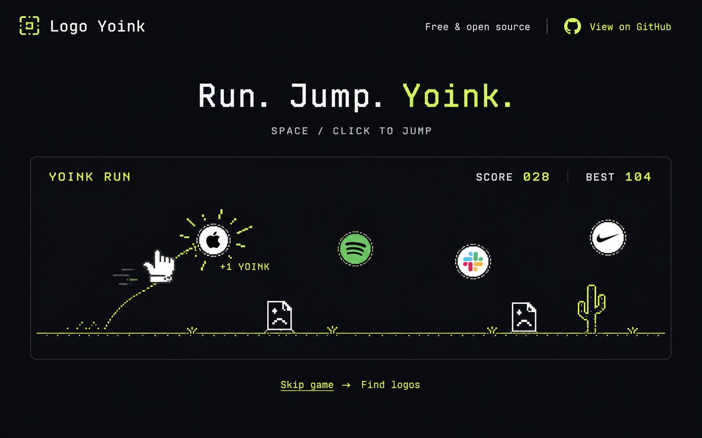
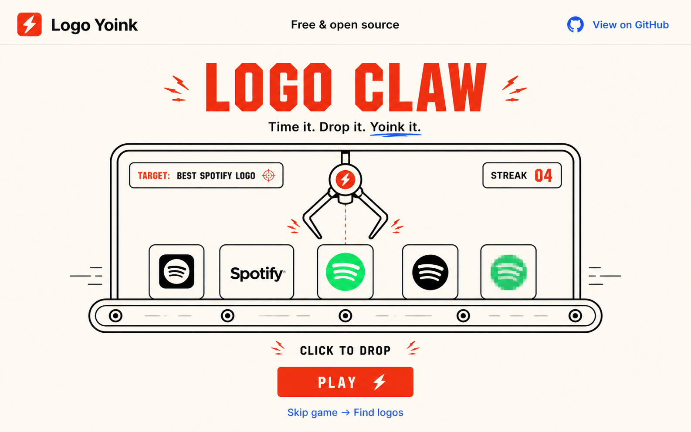
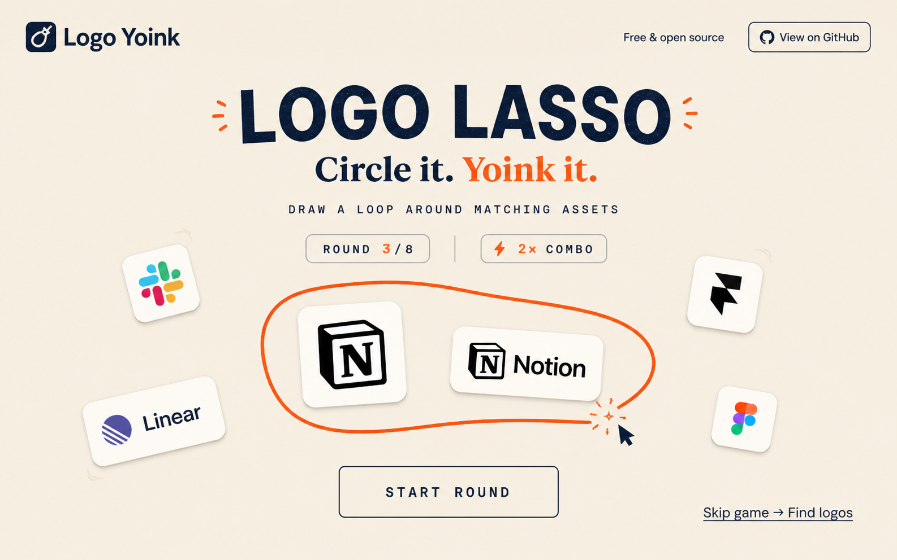
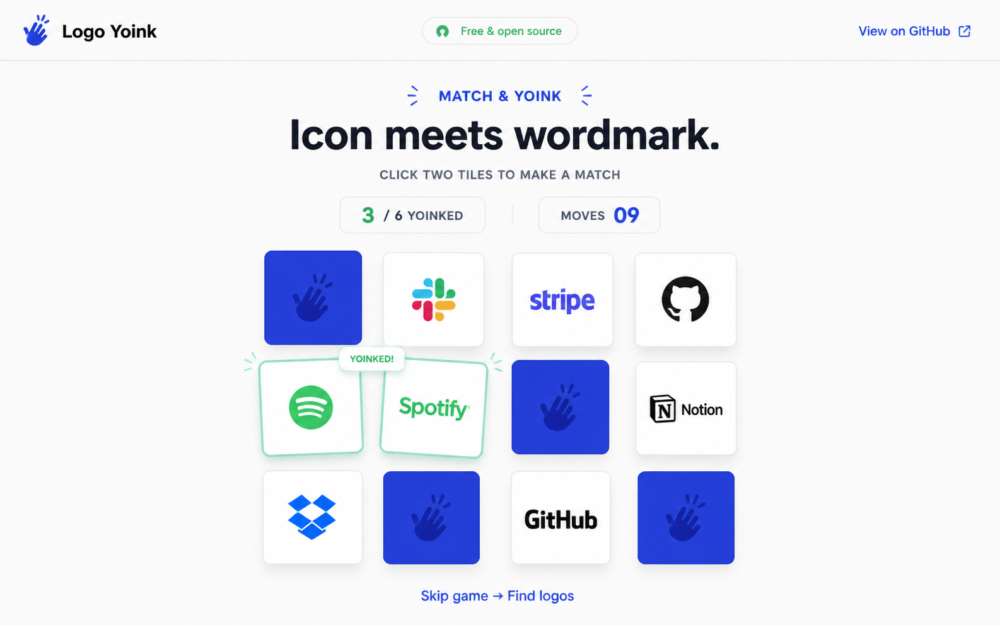
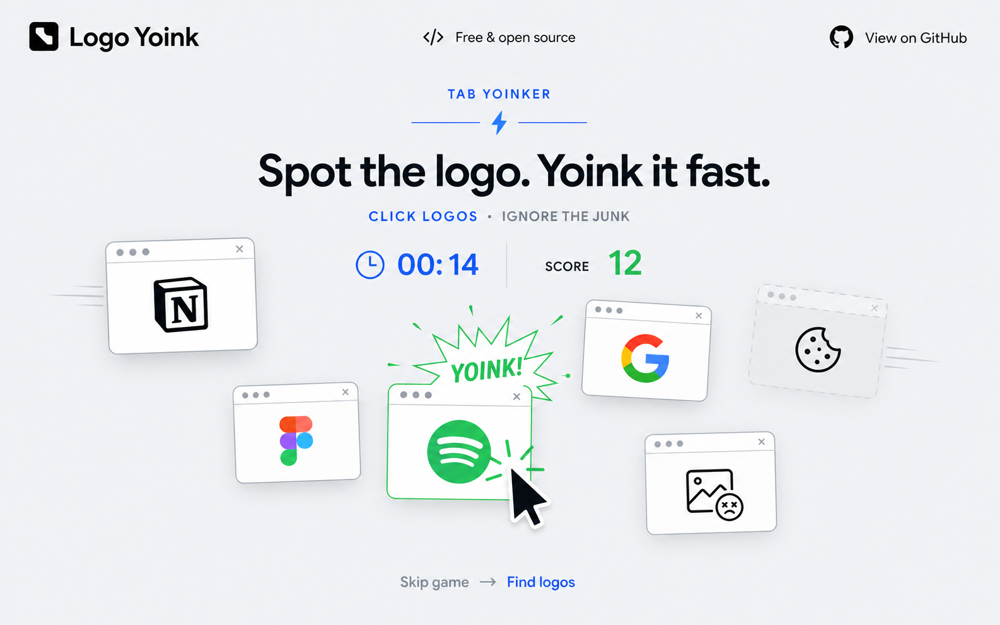

# Logo Yoink homepage game concepts

The game should be playable immediately, require at most one short instruction, and always offer a visible `Skip game → Find logos` path. It should introduce the “yoink” personality without hiding the actual logo-finding tool.

## 1. Yoink Run

An endless runner inspired by the immediacy of offline browser games. A cursor-hand runs automatically across a thin baseline. The player presses Space, clicks, or taps to jump into logo tokens while avoiding broken-image files.

- **Input:** Space, click, or tap
- **Scoring:** One point per logo; consecutive logos build a multiplier
- **Failure:** Hitting a broken-image obstacle ends the run
- **Why it fits:** It is instantly recognizable, highly replayable, and makes “yoinking” physical
- **Small MVP:** One character, one jump animation, three logo tokens, one obstacle, local high score

## 2. Logo Claw

A one-button timing game. Several versions of the requested company logo move along a conveyor. The player clicks once to drop the claw onto the best-quality asset rather than a favicon, blurry image, or monochrome fallback.

- **Input:** Click or tap to drop
- **Scoring:** Quality score of the captured asset; correct grabs extend a streak
- **Failure:** No hard failure; weak assets simply score fewer points
- **Why it fits:** It mirrors Logo Yoink's ranking problem and teaches players what a good asset looks like
- **Small MVP:** Fixed-speed conveyor, five assets, one moving claw, quality score

## 3. Logo Lasso

Logo icons and wordmarks drift gently around the screen. The player draws a loop around assets belonging to the same company. Closing a correct loop pulls—or “yoinks”—the set off the board.

- **Input:** Mouse or touch drag
- **Scoring:** More matching variants inside a clean loop earn more points
- **Failure:** Including an unrelated logo breaks the combo
- **Why it fits:** The lasso gesture makes the product name memorable and highlights logo variants
- **Small MVP:** Six draggable-looking assets, freehand SVG path, point-in-polygon matching, eight rounds

## 4. Match & Yoink

A compact memory game where one tile contains a company's square icon and its matching tile contains the wordmark. Matching the two makes the pair lift off the board with a satisfying “Yoinked!” animation.

- **Input:** Click or tap two tiles
- **Scoring:** Complete all pairs in the fewest moves
- **Failure:** None; the challenge is efficiency
- **Why it fits:** It teaches that a company can expose multiple valid logo forms and works well on mobile
- **Small MVP:** Six pairs, flip animation, move counter, shuffled board

## 5. Tab Yoinker

Small browser-like windows pop into the playfield. The player clicks company logos while ignoring cookie notices, tracking symbols, ads, and broken images. The pace accelerates during a short timed round.

- **Input:** Click or tap targets
- **Scoring:** Correct logos add points and time; junk removes a point
- **Failure:** The round ends when the timer reaches zero
- **Why it fits:** It turns the messy reality of website asset discovery into a simple reflex game
- **Small MVP:** Twenty-second timer, logo and junk target pool, spawn animation, score counter

## Recommendation

Build **Yoink Run** first. It best matches the requested offline-dinosaur-game feeling, requires only one control, and is easy to understand without instructions. Keep the first version intentionally small: a 20–30 second run, local best score, keyboard/touch support, and a persistent path into the real logo finder.

**Logo Claw** is the strongest fallback if the homepage should explain the actual product more directly. It turns asset ranking into the game mechanic and can reuse real extraction results later.
